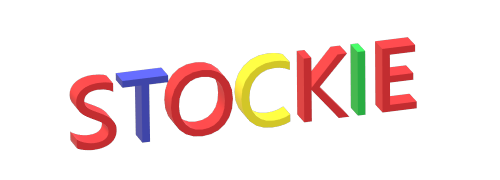

[![Pull][pr]][pr-url]
[![Issues][issues]][issues-url]
[![Size][repo]][repo-url]
[![Last][last]][last-url]
[![Contributors][contributors]][contributors-url]
[![License][license-shield]][license-url]
[![LinkedIn][linkedin-shield]][linkedin-url]
![github-shield]

 

  
  <h3 align="center">Stockie</h3>
  

    Welcome to the GitHub repository of Stokie!
     
    <a href="https://github.com/shridpant/stockie/blob/main/README.md"><strong>Explore the docs »</strong></a>
     
    ·
    <a href="https://github.com/shridpant/stockie/wiki">Wiki</a>
    ·
    <a href="https://github.com/shridpant/stockie/issues">Request Feature</a>
    ·
    <a href="https://github.com/shridpant/stockie/issues">Report Bug</a>
    ·
  

<!-- TABLE OF CONTENTS -->
## Table of Contents

* [About the Project](#about-the-project)
    * [Built With](#built-with)
    * [Usage](#usage)
* [Features](#features)
* [Contrubuting](#contributing)
* [License](#license)
* [Contact](#contact)
* [Acknowledements](#acknowledements)

<!-- ABOUT THE PROJECT -->
## About The Project

[![Product Name Screenshot][product-screenshot]](https://github.com/shridpant/stockie)

This repository contains the source code for *Stockie*- an investment portfolio management web application. The state-of-the-art analysis tools provide real-time insights for its users. Analysis of tweets, relevant news, the stocks' historic performances and many other parameters are evaluated for *the most up-to-date* insights.

### Built With

The server-side application was built with Flask. Other resources included SQLite3 for database management, and HTML, CSS and JavaScript for the client-side application. Stockie was made possible by [many](#acknowledements) open-sourced libraries and frameworks.

### Usage

The web interface is simple and easy to use. After a one-step registration process, the users may log in and immediately start trading stocks. Each user is provided with $10,000/- cash at the start, which the users may utilize to trade stocks. To execute, simply:

1. Clone this repository with git clone `https://github.com/shridpant/stockie`.
2. Navigate to the root folder of the project and execute `pip install -r requirements.txt` to install all dependencies.
3. Author _keys.json_ on the root folder of the project with relevant keys from _IEX_, _News API_ and _Twitter_. Learn more about _keys.json_ [here](https://github.com/shridpant/stockie/wiki/Get-Keys).
4. Start your server with `python app.py`.
5. Open the address from your terminal on your browser. And you're all set!
## Features

Stockie provides state-of-the-art *stock analysis tools* to its users. This includes up-to-date performance metrics from trusted sources, real-time tweet and news insights, and a recommender engine based on the stocks' historic data. An example of the insights:

[![Insights Screenshot][insights-screenshot]](https://github.com/shridpant/stockie)

If a registered `stock symbol` was entered as a search query, a request is made via _yfinance_ for additional information. The user is, then, provided a link to a dynamically created _company profile_ for additional insights. An example of the *company profile*: 

[![Company Profile Screenshot][company-screenshot]](https://github.com/shridpant/stockie)

The users may connect with one another to engage in relevant discussions. Each user maintains a public profile bearing their public contact information. The users may search and visit each other's profiles to chat/email/phone. An example of this profile:

[![Profile Screenshot][profile-screenshot]](https://github.com/shridpant/stockie)

## Contributing

This project welcomes contributions and suggestions. Feel free to fork this repository or submit your ideas through [issues](https://github.com/shridpant/stockie/issues). Please carefully read and follow the [Contributor Covenant Code of Conduct](https://github.com/shridpant/stockie/blob/main/CODE_OF_CONDUCT.md) while participating in this project.

<!-- LICENSE -->
## License

Distributed under the MIT License. See [LICENSE](https://github.com/shridpant/stockie/blob/main/LICENSE) for more information.

<!-- CONTACT -->
## Contact

Feel free to hmu on my [LinkedIn](https://www.linkedin.com/in/shridpant/).

<!-- ACKNOWLEDGEMENTS -->
## Acknowledements

Stockie wouldn't be possible without the following resources:

* [Twitter](https://developer.twitter.com/en)
* [yfinance](https://github.com/ranaroussi/yfinance)
* [IEX](https://iextrading.com/developer)
* [News API](https://newsapi.org/)
* [Chart.js](https://www.chartjs.org/)
* [Flask](https://flask.palletsprojects.com/en/1.1.x/)
* [Bootstrap](https://getbootstrap.com)
* [CS50](https://cs50.harvard.edu/)
* [Jupyter Notebook](https://jupyter.org/)
* [JQuery](https://jquery.com)
* [Google Fonts](https://fonts.google.com/)
* [Img Shields](https://shields.io)
* [Screely](https://www.screely.com/)
* [Freepik from Flaticon.com](https://www.flaticon.com/authors/freepik)

<!-- MARKDOWN LINKS & IMAGES -->
[pr]: https://img.shields.io/github/issues-pr/shridpant/stockie
[pr-url]: https://github.com/shridpant/stockie/pulls
[repo]: https://img.shields.io/github/repo-size/shridpant/stockie
[repo-url]: https://github.com/shridpant/stockie
[last]: https://img.shields.io/github/last-commit/shridpant/stockie
[last-url]: https://github.com/shridpant/stockie/commits/main
[contributors]: https://img.shields.io/github/contributors/shridpant/stockie
[contributors-url]: https://github.com/shridpant/stockie/graphs/contributors
[issues]: https://img.shields.io/github/issues-raw/shridpant/stockie
[issues-url]: https://github.com/shridpant/stockie/issues
[license-shield]: https://img.shields.io/apm/l/vim-mode
[license-url]: https://github.com/shridpant/stockie/blob/master/LICENSE
[linkedin-shield]: static/readme/linkedin.svg
[linkedin-url]: https://www.linkedin.com/in/shridpant/
[github-shield]: https://img.shields.io/github/followers/shridpant?style=social
[product-screenshot]: static/readme/screenshot.PNG
[insights-screenshot]: static/readme/insights-screenshot.PNG
[company-screenshot]: static/readme/company-screenshot.png
[profile-screenshot]: static/readme/profile-screenshot.PNG
